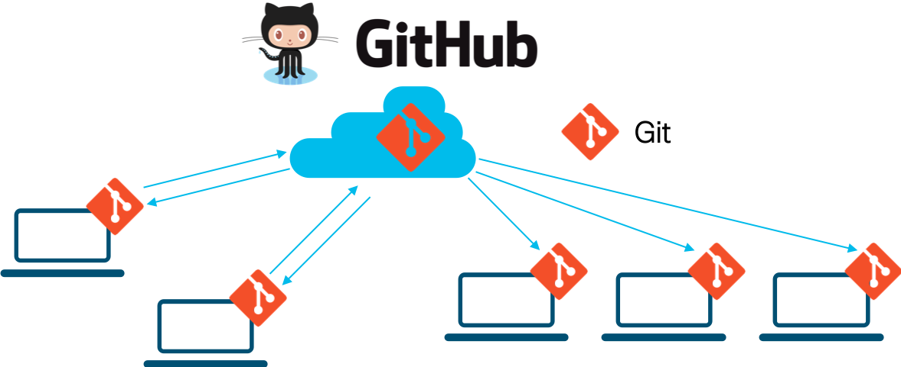

# Step 1: Intro to version control systems

Whether you come from a coding background or not, chances are, you have run into the need for a Version Control System (VCS). Ever had any of these questions?

* How do I make incremental changes and share my work with others?
* How do I go back to the version of this file from (yesterday, last week, last year, ...)?
* What changed between version X and version Y of a file?
* People have been making changes to the same file (or set of files)...  How do I reconcile and merge all these changes?

If you have ever asked yourself any of these questions, you have a need for a Version Control System.

Version Control Systems address problems like those described above and others that you probably haven't thought of yet (and we aren't including here). They are powerful tools that help you share files, track changes, and manage changes and contributions from authors and contributors.

A number of Version Control Systems are available today ([Git](https://git-scm.com/), [Mercurial](https://www.mercurial-scm.org/), [Subversion](https://subversion.apache.org/), and others...).  For our purposes, which are:

1. Getting you a copy of the sample we are going to work with
2. Getting you started with a basic VCS workflow

We are going to use the Git Version Control System and GitHub as our central code repository.

## Git vs. GitHub

**Git** is an open source ([git-scm.com](https://git-scm.com/)) Distributed Version Control System, while **GitHub** is a commercial company that runs the [GitHub.com](https://github.com/) repository, based on Git VCS tech.

Git is the underlying VCS technology and utility that is tracking changes and providing the tools to work with the files under "version control." GitHub is the cloud service we have chosen to host our sample code repository. GitHub enables content authors and contributors with both a place to host their version controlled files and powerful collaboration tools that support the content development and maintenance processes. GitHub also enables sharing and distribution of your version controlled files including mechanisms and tools for formal release versioning, content documentation and even static web hosting for your project.

## Basic Git terminology

* **Repository (Repo)**: A repository is essentially what its name describes: a vault (or repository) for storing the version-controlled files and data. On your computer a Git repository will look like a regular folder or directory, with one important difference: the repository directory will have a hidden `.git/` subdirectory.  This subdirectory is where Git stores the committed version controlled files and other repository data. You don't have to worry about or work with this hidden subdirectory, but now you know where the magic ✨ is!
* **Working Directory**: This is what you see on your computer when you look in the repository directory on your computer - the visible directory and its contents - these are your version-controlled and un-versioned files and folders.
* **Versioned Files**: Files that you have asked git to track.
* **Un-Versioned Files**: Files in your working directory that you haven't asked git to track.
* **Commit**: A commit is a snapshot in time of your version controlled files. Once committed, this snapshot is (almost) indelibly locked into the repository - always available for future retrieval and comparison.
* **Branches**: Branches enable parallel work within a repository. We create new branches to split-off work done by different people, to experiment with changes we might want to back out later, or to develop new features.  Git provides tools to help visualize, reconcile and merge together changes made in different branches.

## A peek under the hood

_[Image Source: git-scm.com](http://git-scm.com/figures/18333fig0903-tn.png)_

When you commit changes to version controlled **files**, Git stores _full copies_ of all the changed files. It also stores a **tree** which contains links to all the changed files and previously-committed-unchanged-files in the current commit. Git computes a SHA1 hash of all stored files, trees and commits, and then uses the commit hashes to uniquely refer to individual commits. By computing and storing these hashes, git can detect changes to files and assure that the files retrieved from the repository are exactly as they were when committed to the repository.

> "It's impossible to get anything out of Git other than the exact bits you put in."
> [git-scm.com - Data Assurance](https://git-scm.com/about/info-assurance)

The best way to get started with Git is to dive in and get your hands on it!

**Next step: basic git workflows**
