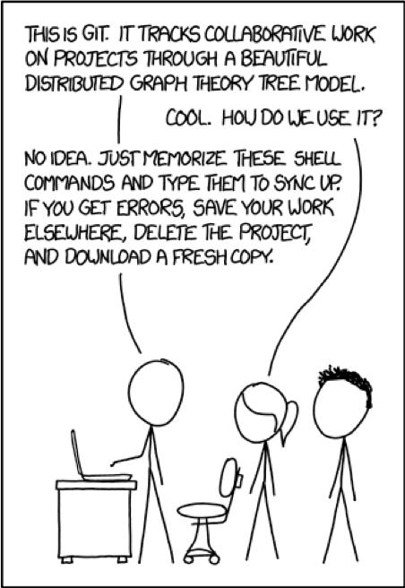
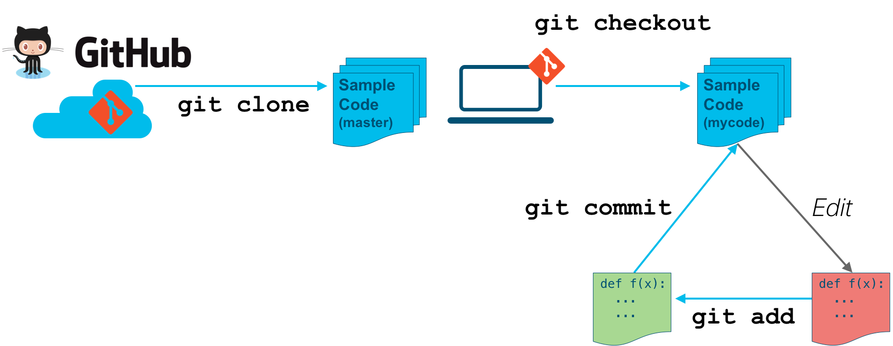

# Step 3: The DevNet sample-code workflow

Now that you have learned some of the basic Git workflows, unbeknownst to you, you have already learned a _macro workflow_ - a workflow that provides a consistent process to get larger portions of work done.

_[Image Source: xkcd.com](https://www.xkcd.com/1597/)_

_**Anytime you need to:**_

1. Download (clone) a local copy of a remote repository to your workstation.
2. Create a "safe place" (branch) for you to make edits.
3. Save (commit) your incremental changes.

...you now have a workflow to get that done.

To accomplish this macro workflow, we did the following:

| Step | Action                             | Git Commands                     |
|:-----|:-----------------------------------|:---------------------------------|
| 1    | Clone the Remote Repository        | `git clone <url>`                |
| 2    | Create and Checkout a Local Branch | `git checkout -b <new branch name>` |
| 3    | Incrementally Commit Changes       | `git add <new or modified file>` `git commit -m "Commit Message"` |

**Next step: Where to go to learn more**
