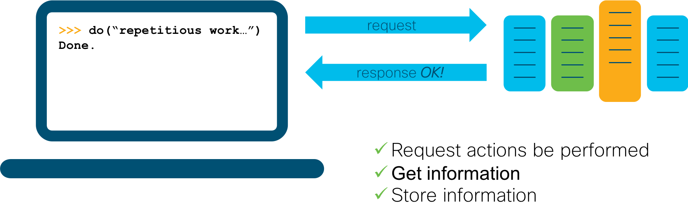

# Step 1: The value proposition

Learning to code and work with programmable infrastructures will require an investment of your time.  You start small and see initial and incremental returns on your investments.  As you begin this journey, let's take a moment to understand the value of the investment you are making.

### The value of using APIs

You have an infrastructure full of products; designed for use by you - a human. I know it may not always seem that way, but human operators are the target users of the command line interfaces and web interfaces that you work with.  Which means that when you need to get something done via these interfaces, you (or some other human) has to do the work.


You won't have to think back too far to remember the last time that you needed to complete some _bulk-task_ on a computer. The task probably involved a lot of clicking, typing, copying-and-pasting, or other mind-numbing repetitions. These human interfaces (and the paradigm of having humans do the work) are to blame for the bulk-work that we sometimes have to do to complete a task.

Computers are great at bulk-work, but if you want your laptop to talk to your infrastructure to do some piece of work for you, you are going to need a _machine-to-machine_ interface or API (Application Programming Interface); an interface designed for computer interaction.



We use these machine-to-machine APIs to make simple requests of our infrastructure, which in aggregate, enable us to complete powerful tasks.

Using APIs to make simple requests like...

* Get the status for interface X
* Get the last-change time for interface X
* Shutdown interface X
* Set the description of interface X to "Interface disabled per Policy"

...enables you to complete a powerful task like:

> "Disable all ports that have been inactive for 30 days."

Sure, you could do this manually, but wouldn't it be better to _codify the process_ (write it once) and then let your computer run this task whenever you need it done?

**Modern APIs make it easy for you to make requests of your apps and infrastructure.**

If you need some information, ask for it.  Want something done? Make the request. Using a machine-to-machine API means your request will complete, your data retrieved, or you will receive notification to the contrary - all done in a way that enables you to automate the interaction.

_Okay, APIs make it easy for me to make requests of my infrastructure, but what makes it easy for me to codify my processes?_

### The value proposition for programmability

Coding is the process of writing down instructions, in a language a computer can understand, to complete a specific task.

**Q: What task?**</br>
_A: Your task._

For example, here is some sample code that could complete the task "Disable all ports that have been inactive for 30 days":

```python
for switch in my_network:
    for interface in switch:
        if interface.is_down() and interface.last_change() > thirty_days:
            interface.shutdown()
            interface.set_description("Interface disabled per Policy")
```

You may not understand the language's syntax _(yet - don't worry we'll teach you)_, but hopefully you can see the simple codified process that we are asking the computer to follow:

1. For each switch in my network...
2. For each interface in the switch...
3. If the interface is down, and hasn't changed states in more than thirty days, then:
    1. Shutdown the interface.
    2. Update the interface's description.

This is essentially the process that you as a human would go through to complete the same task. By taking the time to codify it (write it down in a machine interpretable language), you can now ask the computer to _do the task_ whenever you need it done.  You _the human_ are providing the intelligence: _what needs to be done_ and _how it should be done_, while letting the computer do the boring and repetitious work - which is what it does best - **win-win**.  🙌

_That sounds great, but programming languages aren't as simple as what you showed above._

While the code sample above is a snippet of a larger script, and is calling other functions (like `interface.last_change()` and `interface.shutdown()`), implementing the utility functions is straightforward and the code shown is actual valid Python code that would complete the task.  **The core logic is that simple.**

**Next Step: What changed?**
