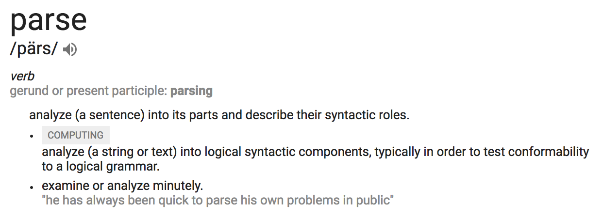

# Step 2: Parsing JSON

### What is JSON?

JSON stands for _JavaScript Object Notation_, and it is a standardized, name-value pair data-interchange format used to exchange data _as structured text_ between many applications and programming languages.

> You don't have to know any JavaScript to use and understand JSON data.

JSON syntax is relatively lightweight (compared to XML) and easy to learn. In fact, as a Python coder you already know most of the syntax.

Take a look a look at the following JSON data:

```json
{
    "ietf-interfaces:interface": {
        "name": "GigabitEthernet2",
        "description": "Wide Area Network",
        "enabled": true,
        "ietf-ip:ipv4": {
            "address": [
                {
                    "ip": "172.16.0.2",
                    "netmask": "255.255.255.0"
                }
            ]
        }
    }
}
```

Look familiar? It should! JSON syntax is _almost_ identical to syntax used by Python's native data structures; however, there are a few important differences.

_**Can you spot the differences?**_

_This is the same data as above, only parsed into Python's native data types:_

```python
{
    'ietf-interfaces:interface': {
        'name': 'GigabitEthernet2',
        'description': 'Wide Area Network',
        'enabled': True,
        'ietf-ip:ipv4': {
            'address': [
                {
                    'ip': '172.16.0.2',
                    'netmask': '255.255.255.0',
                },
            ],
        },
   },
}
```

_You might have noticed:_

* **The use of single vs. double quotes**: Python doesn't care, but JSON does. JSON strings must be delineated using double quotes `" "`.
* **The capitalization of the boolean value `true`**:  Python uses `True` with a capital `T` and `False` with a capital `F`, while JSON uses an all-lowercase convention of `true` and `false`.
* **Trailing commas**: This is another difference where Python doesn't care (and will ignore any trailing commas), but JSON does care and will complain if you accidentally leave some trailing commas in your JSON data.

_Some things that you wouldn't have noticed (because they weren't visually contrasted in the like-for-like example above):_

* The outermost element of a JSON data structure must be an "object" (which is the JSON name for a name-value pair data structure, like Python's dictionary).
* Python can use any _immutable_ and _hash-able_ data type as a name in a dictionary. JSON names must be strings.

Knowing those differences: if you can write Python dictionaries, lists, and strings, integers, floats, and booleans, then you can read and write structured JSON text.

> **Note:** Neither Python nor JSON care about whitespace within (between the elements of) their data structures. You will see Python and JSON data without all of the whitespace between the elements as shown above. It is syntactically the same, but harder for humans to read. We will try to always show you pretty-printed data so that us humans can more readily understand what we are looking at.

Now that you know how to read and write structured JSON text, let's talk about how we are going to parse that text into data inside your script.

### What is Parsing?



_source: [google.com](https://www.google.com/search?q=parsing)_

Parsing is the process of analyzing text into its logical syntactic components, and writing code that parses text into data is about as much fun as this definition sounds.

Imagine trying to write a bit of code just to extract the name and value pair `"enabled": true,` from the above JSON text.  You would first have to locate where this name-value pair begins. Then you would have to write code to recognize the name as being contained within the opening and closing quotation marks. Then you would have to tell it to recognize that the value starts after the colon, and ends where? When it reaches a comma?  What if it was the last element in the set of name-value pairs? No trailing commas! ... _**#Pain**_

Writing flexible and reliable parsers is hard. Fortunately for you and I, this has already been done for us by the wonderful Python community.

### Using the Python `json` module

The [`json` module in the Python Standard Library](https://docs.python.org/3/library/json.html) contains encoding and decoding functions that "do the hard work for you," when it comes to parsing and working with JSON data.

The module's load-from-string `json.loads()` function parses JSON text contained within a string and returns the Python-native data structures.

The module's dump-to-string `json.dumps()` function takes your Python-native data structures and attempts to convert them into a JSON string. It can even make the JSON human-friendly, if you pass it the argument `indent=4`.

> **Note:** Not all Python data structures can be parsed into JSON notation. For example, if you created your own class, Python would have no knowledge as to how objects created from your class should be represented in JSON format. It is best to stick with Python's native data structures (`dict`, `list`, etc.) when you want your data to be able to be encoded as JSON text.

_**Run the following script on your developer workstation, then open it up in your editor and let's review its contents.**_

```shell
$ python intro-python/parsing-json/parsing_json.py
```

<details>
<summary> Click for Expected Output </summary>
<pre><code>(venv) [root@localhost]# python intro-python/parsing-json/parsing_json.py
json_text is a <class 'str'>
{
    "ietf-interfaces:interface": {
        "name": "GigabitEthernet2",
        "description": "Wide Area Network",
        "enabled": true,
        "ietf-ip:ipv4": {
            "address": [
                {
                    "ip": "172.16.0.2",
                    "netmask": "255.255.255.0"
                }
            ]
        }
    }
}

json_data is a <class 'dict'>
{'ietf-interfaces:interface': {'description': 'Wide Area Network',
                               'enabled': True,
                               'ietf-ip:ipv4': {'address': [{'ip': '172.16.0.2',
                                                             'netmask': '255.255.255.0'}]},
                               'name': 'GigabitEthernet2'}}
</code></pre>
</details>

_**Code Review:**_

1. Import the modules and functionality that we want to use in our script at the top of our Python file.

    ```python
    import json
    import os
    from pprint import pprint
    ```

2. Locate the full path of the directory where this is script resides on your development workstation, and store the directory path in the variable `here`.

    ```python
    # Get the absolute path for the directory where this file is located "here"
    here = os.path.abspath(os.path.dirname(__file__))
    ```

3. Use the full path for "here" to open and read-in the contents of the JSON file `interface-config.json` into the variable named `json_text`.

    ```python
    # Read in the JSON text
    with open(os.path.join(here, "interface-config.json")) as file:
        json_text = file.read()
    ```

4. Display the type and contents of `json_text`.

    ```python
    # Display the type and contents of the json_text variable
    print("json_text is a", type(json_text))
    print(json_text)
    ```

5. Use the `json` module's load-from-string `loads()` function to parse the text into native Python data.

    ```python
    # Use the json module to parse the JSON string into native Python data
    json_data = json.loads(json_text)
    ```

6. Pretty-print the type and contents of the `json_data` variable.

    ```python
    # Display the type and contents of the json_data variable
    print("json_data is a", type(json_data))
    pprint(json_data)
    ```

**Next: Working with nested data**
