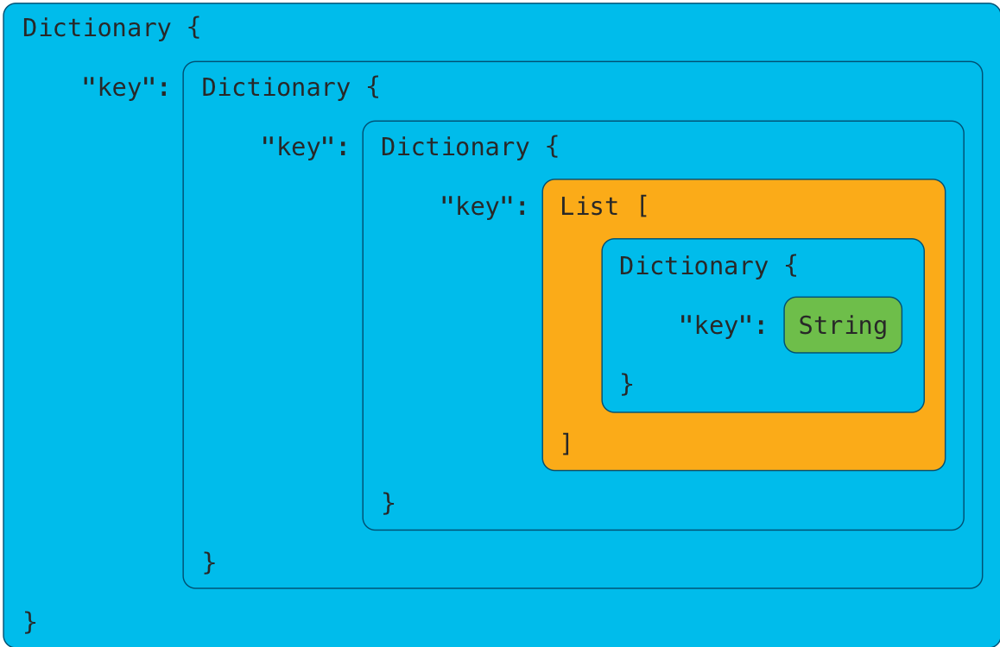

# Step 3: Working with nested data

_What is nested data?_  Imagine that you have:

* A string which is the value of a dictionary name-value pair.
* That dictionary is one element of a list.
* That list is the value of a dictionary name-value pair.
* That dictionary is the value of dictionary name-value pair.
* That dictionary is the value of dictionary name-value pair.
* That dictionary is the value of dictionary name-value pair.

_Visualized..._



That might seem excessive, but that is precisely the case with the `ip` address in the JSON example we looked at in the previous step.

```json
{
    "ietf-interfaces:interface": {
        "name": "GigabitEthernet2",
        "description": "Wide Area Network",
        "enabled": true,
        "ietf-ip:ipv4": {
            "address": [
                {
                    "ip": "172.16.0.2",
                    "netmask": "255.255.255.0"
                }
            ]
        }
    }
}
```

Since JSON data is always going to be contained inside a JSON object (think Python dictionary), chances are, you are going to need to access data nested inside one or more data structures. Let's learn how.

### Indexing Nested Data

> **Reminder:** We access an element within a Python data structure using the square braces `[ ]` and the index of the item we want to "extract." Dictionaries use names as their index, while lists use the numerical index of where each element sits in the ordered sequence (starting at zero).

To index into a nested Python data structure to get to the data element that we want, we start with the outermost data structure and "extract" from it the element that we are interested in, and then repeat the process for each nested data structure.

_**Example:**_

_Extracting the "ietf-interfaces:interface" dictionary from the top-level dictionary in from JSON sample above._

```python
>>> pprint(json_data["ietf-interfaces:interface"])
{'description': 'Wide Area Network',
 'enabled': True,
 'ietf-ip:ipv4': {'address': [{'ip': '172.16.0.2',
                               'netmask': '255.255.255.0'}]},
 'name': 'GigabitEthernet2'}
```

> Note that we are now inside the value associated with the top-level dictionary's `"ietf-interfaces:interface"` key.

To get to the `ip` `address` for this interface, we repeat the "extraction process" either mentally or via experimentation in our interactive Python shell, and _**chain the index operations**_ until we have arrived the value we are seeking.

```python
>>> json_data["ietf-interfaces:interface"]["ietf-ip:ipv4"]["address"][0]["ip"]
'172.16.0.2'
```

This takes a little practice; however once you have mastered this skill, you can quickly and easily access _any piece of information_ within a data structure in a single line of code!  Which, beats the heck out having to write a parser to extract some piece of data from a blob of text!

Indexing is great for accessing elements of nested data, but what if you want to work with all of the interfaces in a set of interfaces?

### Looping Through Nested Data

> **Reminder:** You can use a `for` loop to iterate through all of the items in a collection, and to access the items (key-value pairs) in a dictionary, you can use variable unpacking and the dictionary `.items()` method.

_Looping through a `list`:_

```python
>>> my_list = [0, 1, 2, 3, 4]
>>> for item in my_list:
...     print(item)
...
0
1
2
3
4
```

_Looping through a `dict`:_

```python
>>> fruit_inventory = {"apples": 5, "pears": 2, "oranges": 9}
>>> for fruit, quantity in fruit_inventory.items():
...     print("You have {} {}.".format(quantity, fruit))
...
You have 5 apples.
You have 2 pears.
You have 9 oranges.
```

To loop through nested data, all you need to do is:

1. "Extract" the element that you want to loop through.
2. Use that element as the target of your `for` loop.
3. Within your for loop, your loop variable(s) will iteratively be assigned the values of the items within the element you are iterating.

_Example:_

```python
for interface in json_data["ietf-interfaces:interfaces"]["interface"]:
    print(interface["name"])
```

### Hands-on exercise

Try out looping and indexing nested data with the following coding challenge.

**What you are going to do:**

1. Open the `intro-python/parsing-json/nested_data.py` file in your editor.
2. Complete the `TODO` steps in the script to:
    1. Parse the contents of the `intro-python/parsing-json/interfaces.json` JSON file.
    2. Loop through the interfaces in the JSON data.
    3. Print out each interface's: name, IP address, and netmask.
3. Run the script in your Terminal to verify your code works.
4. Commit your changes to your local git branch.

</br>

<details>
<summary> Click for Sample Output </summary>
<pre><code>(venv) [root@localhost]# python intro-python/parsing-json/nested_data.py
GigabitEthernet1: 198.18.134.11 255.255.192.0
GigabitEthernet2: 172.16.255.1 255.255.255.0
Loopback0: 10.0.0.1 255.255.255.255
</code></pre>
</details>

</br>

Try to complete this challenge on your own, but if you get stuck, we've included the solution below.

<details>
<summary> Click for Solution </summary>
<a href="https://github.com/CiscoDevNet/dnav3-code/blob/solutions/intro-python/parsing-json/nested_data.py">View the solution on GitHub.</a>
</details>

</br>

### Did your code work?

Awesome.  Don't forget to use `git add <filename>` and `git commit -m "Your commit message"` to save your success!

**Next: Where to go to learn more**
